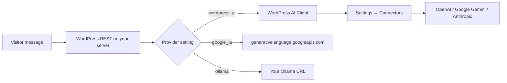

# AI providers — WordPress AI vs Google IA vs Ollama

This document is for site administrators and WordPress.org reviewers. The public plugin readme is [`readme.txt`](../readme.txt); this file expands the same topics for the repository.

## Summary

| Provider | ID | API credentials | Request path |
|----------|-----|-----------------|--------------|
| **WordPress AI** | `wordpress_ai` | **Settings → Connectors** (WordPress 7.0+) | WordPress AI Client (`wp_ai_client_prompt`) |
| **Google IA** | `google_ia` | **MultiAI ChatBot → AI Model** or `MULTCH_GEMINI_API_KEY` in `wp-config.php` | Direct HTTPS to [Google Generative Language API](https://ai.google.dev/) |
| **Ollama** | `ollama` | None in this plugin | HTTP to your Ollama server |

Only **one** provider is active at a time. Choose it under **MultiAI ChatBot → AI Model**.

## Gemini: two supported paths

If you want **Google Gemini**, you can use either path. Both can use the **same model IDs** (e.g. `gemini-2.5-flash`) listed in the admin when WordPress 7.0+ exposes the Connectors catalog.

### WordPress AI (Connectors)

- Connect **OpenAI**, **Google (Gemini)**, or **Anthropic** under **Settings → Connectors** (the connectors currently supported by WordPress 7.0+).
- In this plugin, select **WordPress AI** and pick primary/fallback models.
- The plugin does **not** store your Gemini API key; WordPress core routes the request using Connectors credentials.
- Best when you want **one central place** for AI keys shared across compatible plugins.

### Google IA (direct Gemini API)

- Obtain a [Google AI (Gemini) API key](https://aistudio.google.com/apikey).
- In this plugin, select **Google IA**, enter the key (or define `MULTCH_GEMINI_API_KEY` in `wp-config.php`), and pick primary/fallback models.
- The admin model list still reads Gemini IDs from **Settings → Connectors** when available; only the **model name** is reused. **HTTP requests use your API key**, not Connectors credentials.
- Best when you **only need Gemini**, prefer the key in this plugin or `wp-config.php`, or are not using Connectors for Google.

## Data sent to third parties

Transmission happens **only when a visitor sends a chat message** (not on page load, not in the background).

Typical payload per request:

- Visitor message and recent conversation context (from the browser session).
- System prompt from plugin settings.
- Provider/model identifiers needed to generate a reply.

| Data | WordPress AI | Google IA | Ollama |
|------|--------------|-----------|--------|
| Visitor messages | To provider chosen in Connectors | To Google API | To your Ollama host |
| System prompt | Yes | Yes | Yes |
| API key in browser | Never | Never | Never |
| API key stored in this plugin | No | Yes (optional; prefer `wp-config.php`) | No |

The plugin author does **not** receive chat content or telemetry.

## Data stored on your WordPress server

Controlled by **Store statistics and history** under **General** (off by default):

- Conversations and messages (if enabled).
- Telemetry events: provider, model, status, latency (if enabled).
- Rate-limit transients (hashed IP-derived data).
- Plugin settings in `multch_plugin_settings`.

Suggested policy text for your site is registered under **Settings → Privacy** when the plugin is active (see `includes/privacy.php`).

## Compliance

The **site administrator** is responsible for:

- Choosing WordPress AI, Google IA, or Ollama.
- Informing visitors in the site privacy policy.
- Honoring applicable laws and the **terms and privacy policies** of the configured provider(s).

Links (also in `readme.txt`):

- **Google IA / Gemini API:** https://ai.google.dev/gemini-api/terms — https://policies.google.com/privacy  
- **Ollama (website):** https://ollama.com/terms — https://ollama.com/privacy  
- **WordPress AI (Connectors)** — OpenAI, Anthropic, and Google Gemini (only when connected under **Settings → Connectors**):
  - OpenAI: https://openai.com/policies/terms-of-use — https://openai.com/policies/privacy-policy  
  - Anthropic: https://www.anthropic.com/legal/terms — https://www.anthropic.com/legal/privacy  
  - Google (Gemini via Connectors): same Gemini links as above  

OpenAI and Anthropic are reached only through the WordPress AI Client when **WordPress AI** is selected. **Google IA** is a separate plugin provider that calls Google's API directly with your own Gemini API key.

## Configuration reference

See [`docs/env.example`](env.example) and [`README.md`](../README.md).
